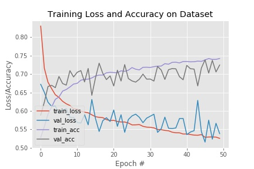

# face-anti-spoofing

this model distinguishes between real images and fake images( pictures of human from mobile or hardcopied photo. It is used for face anti-spoofing in face recognition system.

